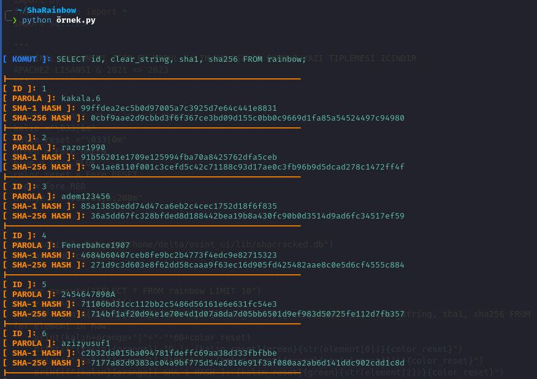

# ShaRainbow Projesi

Bilindiği üzere günümüzde artık md5 gibi devri geçmiş hash algoritmaları yerine "Secure Hash Algorithm" yani Güvenli Hash Algoritması SHA kullanımı yaygınlaşmaktadır. Leak edilmiş Türkçe wordlistlerden ve genel parolaların sha hashları alınarak SQLITE dosyası olarak topladık bu sayede ilk etapta kaba kuvvet yeribe bu veride arama yapılabilir toplamda 2.1 milyon önceden hash alınmış parola mevcut.

 

## Sqlite dosyasının tablo yapısı:

- rainbow (Ana tablomuz)
     - clear_string (parolaların okunur hali)
     - sha1 hash 
     - sha256 hash
     - sha512 hash

 

## Örnek:

 
 

<h1><a href="https://drive.google.com/file/d/1xscPJUloVCFZIB9yze9GX5FAO0cOjqBk/view"> << ShaRainbow Google Drive linki >> </a></h1>

